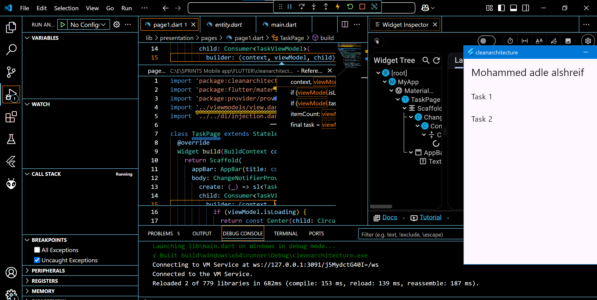

# Implement Clean Architecture: Presentation Layer Logic with Dependency Injection
 

## Requirement 1

Title: Implement Clean Architecture.
Description: 
-Set Up the Project with a Clean Architecture structure and ensure the data, domain, and presentation layers are ready for integration

-Create a simple use case such as fetching a list of items (tasks, products, users, etc.)

-Configure dependency injection using a DI package such as GetIt or Provider then register the use case and the repository in the DI container

-Create a ViewModel or Cubit/BLoC to handle state management in the presentation layer then Inject the required dependencies in the ViewModel using DI and finally Implement logic to fetch data

-create a simple UI to display fetched data