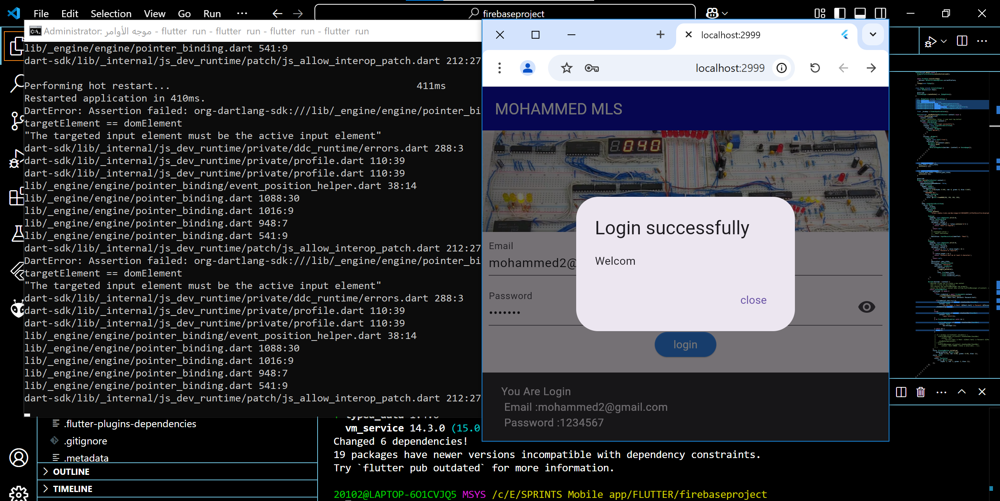

# FireBase - FireBase Authentication - Create a login page for the shopping app that you created in module 2 and add firebase authentication

## Requirement 1

"Title: adding firebase authentication for the shopping app
Description: Install Firebase CLI,
Add Firebase to your project ,
Enable Firebase authentication on the project using email and password methods to sign in.
Create a login page with two input fields for email and password.
Add two buttons the first to navigate to home screen after login ,and the second to signup if he doesn't registered yet."