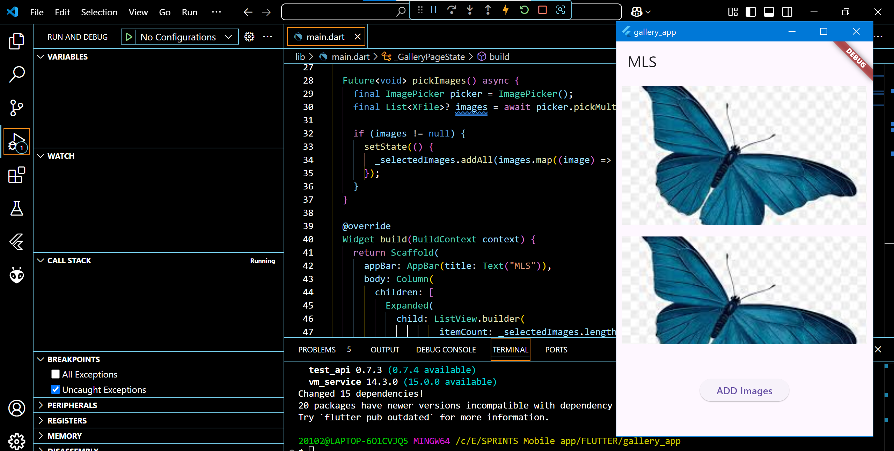

# gallery_app

## Requirement 1

"Title: add listview to your app
Description: create a page that has ListView where the images will be displayed "

 

## Requirement 2

"Title: add a button to choose photos from the device
Description: Build a button below your list its name is
""Pick Image"" once clicked opens the device's gallery 
so you can pick multiple images once you click done 
the images you picked are displayed in the ListView"
