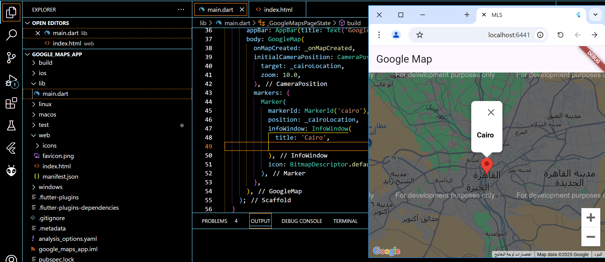
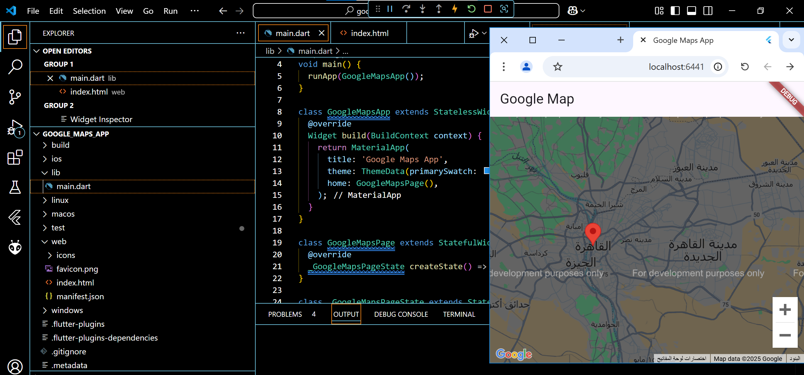

# google_maps_app

## Task General Description
integrate Google Maps into your Flutter application and place a marker on Cairo, Egypt

 

### Requirement 1

"Title: Add Google Maps to your application
Description: Create a page with a title in the appBar ""Google Map""
place in your screen Google map"

 

### Requirement 2

"Title: add marker on Cairo, Egypt
Description: you are asked to place the red marker of 
Google Maps on your screen on cairo government in Egypt"