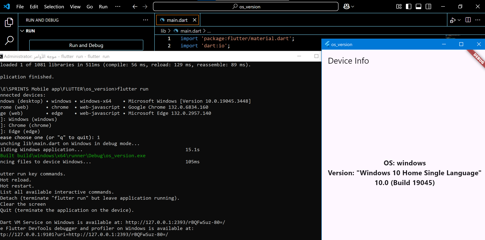

# os_version

dart:io make it easy to know the system 

## Task General Description

The aim of this task is to know how to retrieve information about the device you are using

 

### Requirement 1

Title: show your device model and os version
Description: Design a page and add in the center of it text that displays the device model name and its operating system version
