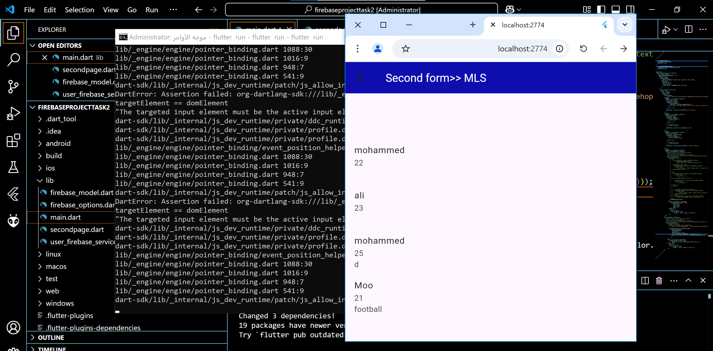
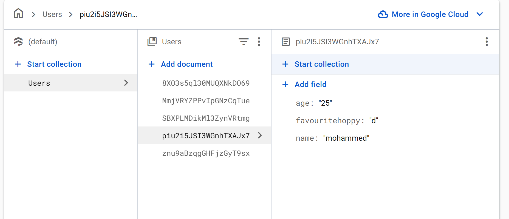

# Create a simple project that takes some info from the user and displays it and saves it on Firestore.

 

## Requirement 1

"Title: Create simple project takes some info from the user and displays it 
Description: Add Firebase to your project ,
Configure and initialize Firebase for your project.
Create the input form page that contains three input fields name, age, and favourite hobby,
then add two buttons the first to save data and the second to navigate to the page that views and displays the saved data."